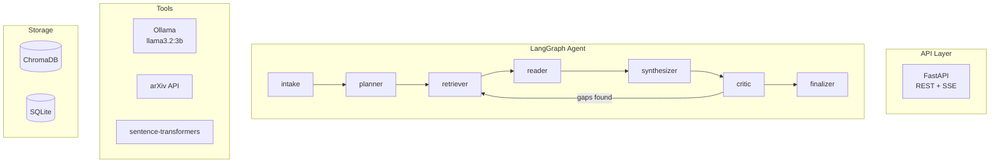

# Agentic Research Copilot

An AI-powered research assistant that transforms vague research objectives into structured, citation-backed reports. Built for **local execution on resource-constrained hardware** (MacBook Pro M2, 8GB RAM).

> **Note**: This project is not currently deployed as a hosted service. If you'd like to try it out, you're welcome to clone the repository and run it locally. The setup is straightforward and documented below. I'd appreciate any feedback or suggestions.

---

## The Problem: Why Traditional RAG Falls Short

Traditional Retrieval-Augmented Generation (RAG) systems follow a simplistic pattern: retrieve documents, stuff them into context, and generate a response. This approach suffers from critical limitations in research-intensive tasks:

1. **Single-Pass Retrieval** - Standard RAG retrieves once and hopes for the best. Complex research topics require iterative exploration—uncovering a relevant paper often reveals new subtopics worth investigating.

2. **No Critical Evaluation** - RAG blindly synthesizes retrieved content without assessing source quality, identifying contradictions, or recognizing gaps in coverage.

3. **Flat Knowledge Representation** - Documents are treated as isolated chunks. The semantic relationships between papers—citations, methodological similarities, conflicting findings—are lost.

4. **Context Limitations** - Stuffing all retrieved documents into a single prompt leads to context overflow and poor synthesis quality.

5. **Zero Observability** - Most RAG pipelines are black boxes. When output quality degrades, debugging is nearly impossible.

---

## The Solution: Agentic Architecture

This project reimagines research synthesis as a **multi-agent workflow** rather than a single retrieval-generation step. The system operates like a research team:

| Agent Node | Role | Advantage Over RAG |
|------------|------|-------------------|
| **Planner** | Decomposes topic into sub-queries | Systematic coverage vs. single-shot retrieval |
| **Retriever** | Multi-source search (arXiv, Semantic Scholar, Wikipedia) | Broader, more authoritative sources |
| **Reader** | Extracts key claims and methods per paper | Structured understanding vs. raw context stuffing |
| **Synthesizer** | Combines findings with proper attribution | Coherent narrative with citations |
| **Critic** | Identifies gaps, contradictions, weak coverage | Self-correction loop—retrieves more if needed |
| **Finalizer** | Produces structured report with all sections | Consistent, actionable output format |

### The Critical Differentiator: The Feedback Loop

The **Critic** node evaluates synthesis quality and can trigger additional retrieval rounds. This mimics how humans actually research: read papers, identify what's missing, search again. Traditional RAG cannot do this—it's strictly feed-forward.

---

## Core Capabilities

| Capability | Description |
|------------|-------------|
| **Multi-Agent Supervisor** | LangGraph workflow with 7 specialized nodes |
| **Multi-Source Retrieval** | arXiv, Semantic Scholar, Wikipedia integration |
| **Knowledge Graph** | NetworkX-based paper relationship mapping |
| **Semantic Cache** | Reduces redundant LLM calls by approximately 40% |
| **Local Observability** | Full execution tracing without external dependencies |
| **Streamlit UI** | Real-time research progress visualization |
| **Export Formats** | Markdown, PDF, BibTeX, JSON |
| **Trend Detection** | Identifies emerging research directions from metadata |

---

## Architecture



---

## Potential Impact

### For Researchers and Academics
- **Literature Review Acceleration**: Reduce weeks of literature survey to hours with automated gap analysis and contradiction detection.
- **Emerging Trend Identification**: Surface research directions before they become mainstream, enabling early positioning.

### For Industry R&D Teams
- **Competitive Intelligence**: Rapidly understand state-of-the-art in any technical domain without manual paper hunting.
- **Decision Support**: Get structured, citation-backed answers to technical feasibility questions.

### For the AI/ML Community
- **Reproducible Research Workflows**: Fully local, open-source stack eliminates vendor lock-in and ensures reproducibility.
- **Resource-Efficient AI**: Demonstrates that sophisticated AI workflows can run on consumer hardware (8GB RAM), democratizing access.

### Broader Implications
This project demonstrates that **agentic architectures fundamentally outperform monolithic RAG** for complex cognitive tasks. The patterns here—iterative refinement, self-critique, structured decomposition—apply far beyond research synthesis to any domain requiring systematic analysis.

---

## Quick Start

### Prerequisites

1. **Install Ollama**
   ```bash
   brew install ollama
   ```

2. **Pull the model**
   ```bash
   ollama pull llama3.2:3b
   ```

3. **Start Ollama server**
   ```bash
   ollama serve
   ```

### Installation

```bash
# Clone and enter directory
cd agentic_research_copilot

# Install dependencies
pip install -r requirements.txt

# Copy environment file
cp .env.example .env

# Create data directories
make dirs

# Start the API server
make dev
```

### Run the UI (optional)

```bash
make ui
```

Visit http://localhost:8501 for the Streamlit dashboard.

---

## API Usage

### Start Research

```bash
curl -X POST http://localhost:8000/v1/research \
  -H "Content-Type: application/json" \
  -d '{
    "topic": "transformer attention mechanisms and their variants",
    "depth": "normal",
    "constraints": "Focus on papers from 2023-2024"
  }'
```

Response:
```json
{
  "run_id": "abc123-...",
  "status": "pending",
  "message": "Research started..."
}
```

### Check Status

```bash
curl http://localhost:8000/v1/runs/{run_id}
```

### Stream Progress (SSE)

```bash
curl -N http://localhost:8000/v1/runs/{run_id}/stream
```

### Export Results

```bash
# Markdown
curl http://localhost:8000/v1/runs/{run_id}/export?format=markdown

# BibTeX
curl http://localhost:8000/v1/runs/{run_id}/export?format=bibtex

# PDF
curl http://localhost:8000/v1/runs/{run_id}/export?format=pdf -o report.pdf
```

### Submit Feedback

```bash
curl -X POST http://localhost:8000/v1/feedback \
  -H "Content-Type: application/json" \
  -d '{"run_id": "...", "rating": 5, "comment": "Comprehensive coverage."}'
```

---

## Report Structure

Every research run produces a structured report:

1. **TL;DR** - Three-bullet executive summary
2. **Background** - Context and foundational concepts
3. **Key Papers/Sources** - 5-10 papers with links and summaries
4. **Disagreements/Contradictions** - Conflicting findings across sources
5. **Gaps and Open Questions** - Identified unknowns in the literature
6. **Research Trends** - Emerging directions based on publication patterns
7. **Proposed Experiments** - Actionable next steps
8. **References** - Complete bibliography with links

---

## Testing

```bash
# Run all tests
make test

# Run specific test file
pytest tests/test_tools_arxiv.py -v

# Run with coverage
pytest tests/ --cov=app --cov-report=html
```

---

## Evaluation

```bash
# Run evaluation suite (20 golden prompts)
make eval

# Check results
cat eval/results.json
```

---

## Configuration

| Variable | Default | Description |
|----------|---------|-------------|
| `OLLAMA_BASE_URL` | `http://localhost:11434` | Ollama API URL |
| `OLLAMA_MODEL` | `llama3.2:3b` | LLM model |
| `OLLAMA_NUM_CTX` | `4096` | Context window |
| `EMBEDDING_MODEL` | `all-MiniLM-L6-v2` | Embedding model |
| `CHROMA_DIR` | `./chroma_data` | ChromaDB path |
| `SQLITE_PATH` | `./app_data/app.db` | SQLite path |

---

## Memory Footprint (8GB RAM Target)

| Component | Usage |
|-----------|-------|
| Ollama + llama3.2:3b | ~2.5 GB |
| sentence-transformers | ~200 MB |
| FastAPI + ChromaDB | ~300 MB |
| **Total** | **~3 GB** |

### Reducing Memory Load

1. **Use `depth: "quick"`** - Limits to 5 sources
2. **Set `OLLAMA_NUM_CTX=2048`** - Smaller context window
3. **Close Streamlit UI** - Saves approximately 150 MB
4. **Stop Ollama when idle** - `ollama stop llama3.2:3b`

---

## Project Structure

```
app/
├── main.py                 # FastAPI application
├── api/                    # API endpoints
├── core/                   # Config, logging, SSE
├── db/                     # SQLite models and repositories
├── agent/                  # LangGraph workflow
├── tools/                  # Ollama, arXiv, embeddings
├── intelligence/           # Knowledge graph, cache
├── traces/                 # Local observability
└── export/                 # Export formats

ui/
└── app.py                  # Streamlit dashboard

eval/
├── golden.json             # 20 test prompts
└── run_eval.py             # Evaluation runner

tests/
├── test_tools_arxiv.py
├── test_tools_vectordb.py
├── test_knowledge_graph.py
├── test_semantic_cache.py
└── test_api_research.py
```

---

## Known Limitations

1. **PDF Parsing** - Skipped for memory efficiency; uses abstracts only
2. **Rate Limits** - Semantic Scholar: 100 requests per 5 minutes
3. **Context Window** - 4096 tokens limits long document processing
4. **CPU Inference** - No GPU acceleration; slower but functional

---

## Troubleshooting

**Ollama not connecting:**
```bash
ollama serve  # Start the server
ollama list   # Check available models
```

**Out of memory:**
```bash
# Use smaller context
export OLLAMA_NUM_CTX=2048

# Use quick depth
curl -X POST http://localhost:8000/v1/research \
  -d '{"topic": "...", "depth": "quick"}'
```

**ChromaDB errors:**
```bash
# Reset the database
rm -rf chroma_data
make dirs
```

---

## Author

Built by [parth-6-5-4](https://github.com/parth-6-5-4)

For questions, issues, or contributions, please open an issue on [GitHub](https://github.com/parth-6-5-4/agentic_research_copilot).

---

## License

This project is licensed under the MIT License. See the [LICENSE](LICENSE) file for details.

---

Built with LangGraph, Ollama, and FastAPI
