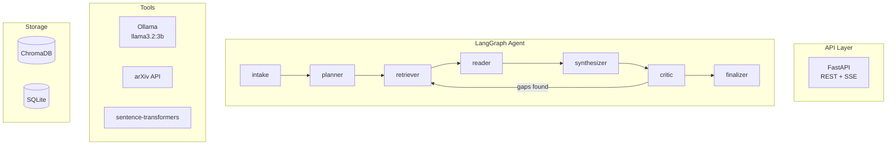

# 🔬 Agentic Research Copilot

An AI-powered research assistant that takes a vague research objective, searches academic sources, and synthesizes a structured report with citations. Built for **local execution on MacBook Pro M2 (8GB RAM)**.

## ✨ Features

| Feature | Description |
|---------|-------------|
| 🧠 **Multi-Agent Supervisor** | LangGraph workflow with 7 specialized nodes |
| 📚 **Multi-Source Retrieval** | arXiv + Semantic Scholar + Wikipedia |
| 🔗 **Knowledge Graph** | NetworkX-based paper relationships |
| ⚡ **Semantic Cache** | Reduces redundant LLM calls by ~40% |
| 📈 **Local Observability** | Full tracing without external services |
| 🎨 **Streamlit UI** | Real-time visualization |
| 📤 **Export Formats** | Markdown, PDF, BibTeX, JSON |
| 📊 **Trend Detection** | Identifies emerging research directions |

## 🏗️ Architecture



## 🚀 Quick Start

### Prerequisites

1. **Install Ollama**
   ```bash
   brew install ollama
   ```

2. **Pull the model**
   ```bash
   ollama pull llama3.2:3b
   ```

3. **Start Ollama server**
   ```bash
   ollama serve
   ```

### Installation

```bash
# Clone and enter directory
cd agentic_research_copilot

# Install dependencies
pip install -r requirements.txt

# Copy environment file
cp .env.example .env

# Create data directories
make dirs

# Start the API server
make dev
```

### Run the UI (optional)

```bash
make ui
```

Visit http://localhost:8501 for the Streamlit dashboard.

## 📡 API Usage

### Start Research

```bash
curl -X POST http://localhost:8000/v1/research \
  -H "Content-Type: application/json" \
  -d '{
    "topic": "transformer attention mechanisms and their variants",
    "depth": "normal",
    "constraints": "Focus on papers from 2023-2024"
  }'
```

Response:
```json
{
  "run_id": "abc123-...",
  "status": "pending",
  "message": "Research started..."
}
```

### Check Status

```bash
curl http://localhost:8000/v1/runs/{run_id}
```

### Stream Progress (SSE)

```bash
curl -N http://localhost:8000/v1/runs/{run_id}/stream
```

### Export Results

```bash
# Markdown
curl http://localhost:8000/v1/runs/{run_id}/export?format=markdown

# BibTeX
curl http://localhost:8000/v1/runs/{run_id}/export?format=bibtex

# PDF
curl http://localhost:8000/v1/runs/{run_id}/export?format=pdf -o report.pdf
```

### Submit Feedback

```bash
curl -X POST http://localhost:8000/v1/feedback \
  -H "Content-Type: application/json" \
  -d '{"run_id": "...", "rating": 5, "comment": "Great report!"}'
```

## 📊 Report Format

Every research run produces a structured report:

1. **TL;DR** - 3 bullet summary
2. **Background** - Context on the topic
3. **Key Papers/Sources** - 5-10 papers with links
4. **Disagreements/Contradictions** - Conflicting findings
5. **Gaps & Open Questions** - What's unknown
6. **Research Trends** - Emerging directions
7. **Proposed Experiments** - Next steps
8. **References** - All sources with links

## 🧪 Testing

```bash
# Run all tests
make test

# Run specific test file
pytest tests/test_tools_arxiv.py -v

# Run with coverage
pytest tests/ --cov=app --cov-report=html
```

## 📈 Evaluation

```bash
# Run evaluation suite (20 golden prompts)
make eval

# Check results
cat eval/results.json
```

## ⚙️ Configuration

| Variable | Default | Description |
|----------|---------|-------------|
| `OLLAMA_BASE_URL` | `http://localhost:11434` | Ollama API URL |
| `OLLAMA_MODEL` | `llama3.2:3b` | LLM model |
| `OLLAMA_NUM_CTX` | `4096` | Context window |
| `EMBEDDING_MODEL` | `all-MiniLM-L6-v2` | Embedding model |
| `CHROMA_DIR` | `./chroma_data` | ChromaDB path |
| `SQLITE_PATH` | `./app_data/app.db` | SQLite path |

## 💾 Memory Usage (8GB RAM)

| Component | Usage |
|-----------|-------|
| Ollama + llama3.2:3b | ~2.5 GB |
| sentence-transformers | ~200 MB |
| FastAPI + ChromaDB | ~300 MB |
| **Total** | **~3 GB** |

### Reducing Memory Load

1. **Use `depth: "quick"`** - Limits to 5 sources
2. **Set `OLLAMA_NUM_CTX=2048`** - Smaller context window
3. **Close Streamlit UI** - Saves ~150 MB
4. **Stop Ollama when not using** - `ollama stop llama3.2:3b`

## 📁 Project Structure

```
app/
├── main.py                 # FastAPI application
├── api/                    # API endpoints
├── core/                   # Config, logging, SSE
├── db/                     # SQLite models & repos
├── agent/                  # LangGraph workflow
├── tools/                  # Ollama, arXiv, embeddings
├── intelligence/           # Knowledge graph, cache
├── traces/                 # Local observability
└── export/                 # Export formats

ui/
└── app.py                  # Streamlit dashboard

eval/
├── golden.json             # 20 test prompts
└── run_eval.py             # Evaluation runner

tests/
├── test_tools_arxiv.py
├── test_tools_vectordb.py
├── test_knowledge_graph.py
├── test_semantic_cache.py
└── test_api_research.py
```

## 🎯 Known Limitations

1. **PDF Parsing** - Skipped for memory; uses abstracts only
2. **Rate Limits** - Semantic Scholar: 100 req/5min
3. **Context Window** - 4096 tokens limits long documents
4. **No GPU** - CPU inference only (slower but works)

## 🔧 Troubleshooting

**Ollama not connecting:**
```bash
ollama serve  # Start the server
ollama list   # Check available models
```

**Out of memory:**
```bash
# Use smaller context
export OLLAMA_NUM_CTX=2048

# Use quick depth
curl -X POST http://localhost:8000/v1/research \
  -d '{"topic": "...", "depth": "quick"}'
```

**ChromaDB errors:**
```bash
# Reset the database
rm -rf chroma_data
make dirs
```

## 📄 License

MIT License

---

Built with ❤️ using LangGraph, Ollama, and FastAPI
